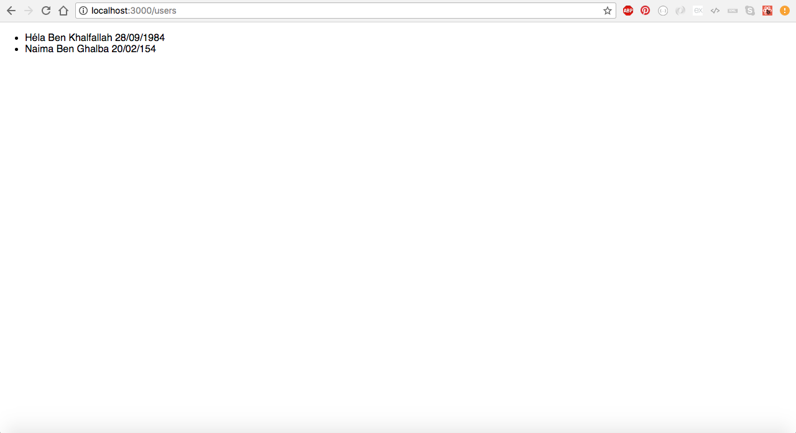

# react-apollo-redux-graphql

1. create a react app :
npx create-react-app react-apollo-redux-graphql

2. configure lint : 
npm install eslint --save-dev 
./node_modules/.bin/eslint --init

3. add airbnb lint style 
npm install babel-eslint --save-dev
npm install eslint-config-airbnb eslint-plugin-import eslint-plugin-jsx-a11y --save-dev

4. configure lint : .eslintrc.js

5. configure dotenv : 
npm install dotenv --save 

and in index.js file and before any load :

```js
// configure env vars
dotenv.config()

// render
ReactDOM.render(<App />, document.getElementById('root'))
registerServiceWorker()
``` 
You should restart app each time you made change on .env file.
REACT_APP_ prefix is nessasary.

6. configure route file :
/routes/Routes.js

modify index.js like this :

```js
import Routes from './routes/Routes'
ReactDOM.render(<Routes />, document.getElementById('root'))
```

7. create application folders (by modules) :

**Module 1 Users :**
- pages : containers / statefull (connected to apollo/redux).
- components : stateless (presentation).
- redux (reducers, actions).
- graphql (graphql queries and mutations).

**Module 2 Photos :**
- pages : containers / statefull (connected to apollo/redux).
- components : stateless (presentation).
- redux (reducers, actions).
- graphql (graphql queries and mutations).

8. customize logger file
yarn add debug
AppLogger.js

9. add content inside UserListPage.jsx
10. install apollo : 
npm install apollo-client apollo-cache-inmemory apollo-link-http react-apollo graphql-tag graphql ---save

11. create an AppApolloClient.js class
12. Results :
 

13. add redux 
npm install react-redux --save
